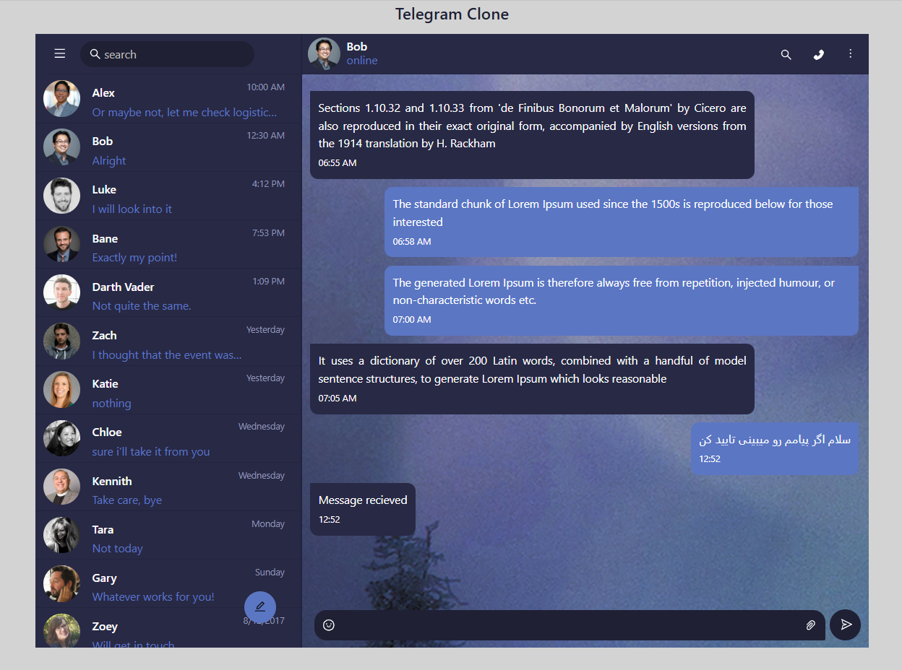

# 💬 Telegram Clone (Redux Toolkit)

A modern Telegram-inspired chat application built with **React**, **Redux Toolkit**, **Ant Design**, and **JSON Server**.

This project focuses on **state management**, **REST API integration**, and **building a scalable chat interface**. It simulates a messaging experience by automatically generating predefined replies after a short delay, providing an interactive chat flow without requiring a real-time backend.

<p align="center">
  
</p>

---

## ✨ Features

- 💬 Telegram-inspired chat interface
- 👥 Friends list
- 📨 Send messages
- 🤖 Automatic reply simulation
- ⏳ Delayed bot responses
- 📂 Chat history
- ⚡ Global state management with Redux Toolkit
- 📱 Responsive design
- 🎨 Built with Ant Design
---


# 🛠 Tech Stack

- React
- Redux Toolkit
- React Redux
- Ant Design
- Axios
- JSON Server
- CSS

---

# 🚀 Installation

Clone the repository

```bash
git clone https://github.com/yourusername/telegram-redux.git
```

Install dependencies

```bash
npm install
```

Start JSON Server

```bash
json-server --watch src/db.json --port 7000
```

Start the React application

```bash
npm start
```

---

# 🌐 API

Base URL

```
http://localhost:7000
```

Available endpoints

```http
GET     /friends
GET     /messages
POST    /messages
PUT     /messages/:id
DELETE  /messages/:id
```

---

# 🧠 Project Highlights

This project demonstrates:

- Redux Toolkit architecture
- Global state management
- REST API integration
- CRUD operations
- Async actions
- Component-based architecture
- Chat UI implementation
- Simulated messaging workflow
- Clean and maintainable code structure

---

# 📁 Folder Structure

```text
src
│
├── assets
├── components
├── pages
├── redux
│   ├── slices
│   └── store.js
├── services
├── utils
├── db.json
└── App.jsx
```

---

# 🚧 Future Improvements

- User Authentication
- File & Image Sharing
- Voice Messages
- Read Receipts
- Dark Mode
- Notification System

---

# 💡 Related Project

A second version of this application is available that implements **real-time messaging using WebSocket**, demonstrating live communication, typing indicators, and socket-based event handling.

---

# 👩‍💻 Author

**Arefe**

Frontend Developer

GitHub: https://github.com/yourusername

LinkedIn: https://linkedin.com/in/yourprofile

---

## ⭐ If you like this project, don't forget to leave a Star!
